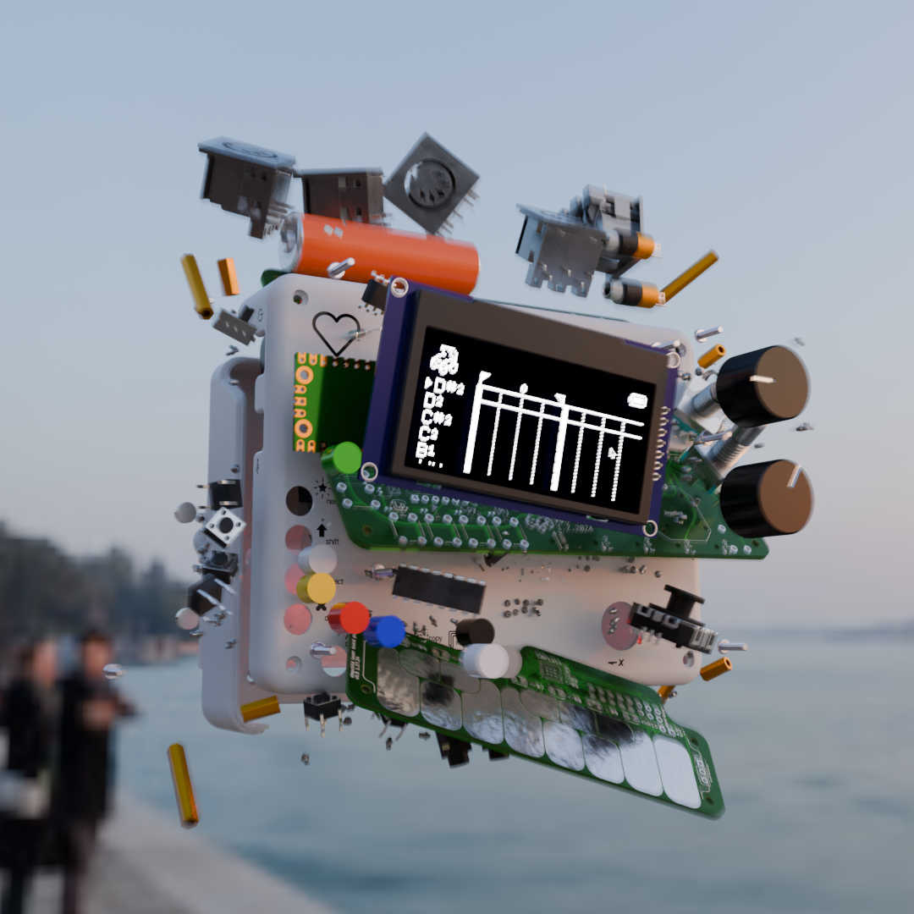
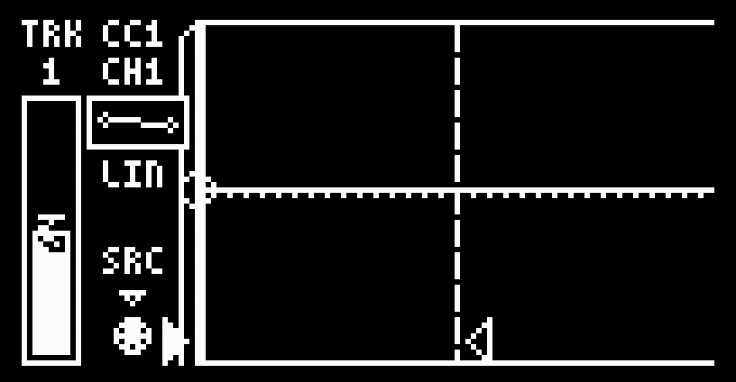

## Index
0. [Introduction](#0-introduction)
    1. [Overview](#01-overview)
    2. [Hardware](#02-hardware)
        1. [Buttons](#a-buttons)
        2. [MIDI Layout](#b-midi-layout)
        3. [Power & Batteries](#c-power--batteries)
    3. [Software](#03-software)
        1. [A Brief Intro to MIDI](#a-a-brief-intro-to-midi)
        2. [Notes](#b-notes)
        3. [Tracks](#c-tracks)
        4. [Timesteps](#d-timesteps)
1. [Main Sequence](#1-main-sequence)
    1. [Moving the cursor](#11-moving-the-cursor)
    2. [Changing the view/Subdivision](#12-changing-the-view--subdivision)
    3. [Creating notes](#13-creating-notes)
    4. [Deleting & Muting Notes](#14-deleting--muting-notes)
    5. [Selecting notes](#15-selecting-notes)
    6. [Moving loops](#16-moving-loops)
    7. [Copy/paste](#17-copy-paste)
    8. [Playback](#18-playback)
        1. Playing
        2. [Recording](#b-recording)
    9. Status Icons
2. [Track Editor](#2-track-editor)
    1. [Changing Track Pitch](#21-changing-track-pitch)
    2. [Changing Track Octave](#22-changing-track-octave)
    3. [Changing Track Channel](#23-changing-track-channel)
    4. [Arming Tracks](#24-arming-tracks)
    5. [Utilities](#25-track-utilities)
        1. [Editing Multiple Tracks](#a-editing-multiple-tracks)
        2. [Tuning Tracks to a Scale](#b-tuning-tracks-to-a-scale)
        3. [Delete Empty Tracks](#c-deleting-empty-tracks)
        4. [Disarming Tracks with Notes](#d-disarming-tracks-with-notes)
    6. [Erasing Tracks](#26-erasing-tracks)
    7. [Muting Tracks](#27-muting-tracks)
    8. [Moving Tracks](#29-moving-tracks)
    9. Latching Tracks
    10. Mute Groups
3. [Note Editor](#3-note-editor)
    1. [Pattern Stencils](#31-pattern-stencils)
    2. [Moving Notes](#32-moving-notes)
    3. [Changing Note Length](#33-changing-note-length)
    4. [Changing Note Velocity & Probability](#34-changing-note-velocity--probability)
    5. [Quantizing Notes](#35-quantizing-notes)
    6. [Humanizing Notes](#36-humanizing-notes)
    7. [The FX Dropdown](#37-the-fx-dropdown)
4. [Menus](#4-menus)
    1. [Main Menu](#41-main-menu)
    2. Settings Menu
        1. Sequence
        2. Playback
        3. System
    3. MIDI Menu
        1. Routing
        2. CV
        3. Thru
    4. [Clock Menu](#44-clock-menu)
        1. [BPM](#a-bpm)
        2. [Swing](#b-swing)
        3. [Clock Source](#c-clock-source)
5. [Autotracks](#5-autotracks)
    1. [Autotrack Viewer](#51-autotrack-viewer)
    2. [Autotrack Triggers](#52-autotrack-triggers)
    3. [Autotrack Curves](#53-autotrack-curves)
        1. [Editing Linear Curves](#a-editing-linear-curves)
        2. [Editing Function Curves](#b-editing-function-curves)
        3. [Combining Curve Types](#c-combining-curve-types)
        4. [Recording To Curves](#d-recording-to-curves)
    4. [CC Messages](#54-cc-messages)
        1. [CC Shortcut Lists](#a-cc-shortcut-lists)
        2. [Internal CC Messages](#b-internal-cc-messages)
6. [Loops](#6-loops)
    1. The Loop Chain
    2. Types of loops
    3. Editing within A Loop
7. [Arpeggiator](#7-arpeggiator)
    1. Step Lengths
    2. Modifiers
8. [Randomizer](#8-randomizer)
    1. Randomizer Settings
    2. Selecting an Area
9. [Instruments](#9-instruments)
    1. XY
    2. Storm
    3. Knobs
    4. Keys
    5. Drumpads
    6. MIDI to CV
    7. Rattle
    8. [Live Loop](#98-live-loop)
10. [FX](#10-fx)
    1. [Quantize](#101-quantize)
    2. Humanize
    3. Strum
    4. Echo
    5. Reverse
    6. Warp
11. [Files](#11-files)
    1. [Quicksaving](#111-quicksaving)
    2. File Browsing
    3. Uploading to a computer
12. [Console](#12-console)
13. [Using the ChildOS Desktop Interface](#13-using-the-childos-desktop-interface)
14. [Misc. Functions](#14-misc-functions)
    1. Creating a Scale
    2. Yes/No Box
    3. Text Input
15. Appendix
    1. Version History
    2. Quickstart
    3. FAQ
16. CV

<!-- END OF TABLE OF CONTENTS -->

# Stepchild V1.0 - *User Manual*
<!-- ###### V1.0 10.15.23 -->

<!--  -->

# 0. Introduction

Hello! Congratulations on your new child and welcome to the user manual. This document is intended to provide detailed information on using the Stepchild to create music. For a quick introduction to the Stepchild, please check out the [quickstart guide](#152-quickstart).

The Stepchild is a multipurpose MIDI instrument, utility, and sequencer designed to utilize the full functionality of the MIDI protocol to control external hardware instruments in fluid and unexpected ways. It's also your baby. The software is currently on version [1.0](#151-version-history) (see [Updating](#) for instructions on how to check and update the Stepchild's firmware). 

For instructions on how to build the Stepchild from a kit (or from scratch!), please see the [build guide](../buildguide.html).

### a. Control Overview

The top of the Stepchild has 8 main buttons labelled **New**,**Shift**, **Select**,**Delete**, **Loop**,**Play**,**Copy**, and **Menu**. The labels on each button indicate the action each triggers when in the [Main Sequencer](#1-main-sequence), but perform different actions depending on the active  menu or instrument.

Also on the top of the Stepchild are the joystick and the two rotary encoders, **A** and **B** which can be pressed (as buttons) or turned (as knobs).

The lower board of the Stepchild has a touch keyboard and 8 LEDs. These keys are used as both MIDI inputs and as auxillary controls for menus and instruments.

### b. Input/Output

The stepchild has **5** separate MIDI outputs and **2** separate inputs. The MIDI DIN jacks on the back of the board are hardwired to the corresponding TRS jacks on the front of the board to allow the Stepchild to connect to devices using both MIDI TRS and MIDI DIN cables. This means that ***the Stepchild sends the same data on TRS jack 1 and MIDI DIN jack 1***. The TRS and DIN jack pairs are collectively referred to as a Port in this manual, although it is possible to route different data to different instruments connected to the same jack pair using channel filters on the receiving instrument.

The Stepchild supports USB MIDI Input/output for communicating with a DAW or independently powered USB MIDI device through its MicroUSB port.

**Port 1** and the **USB Port** are both MIDI Inputs. The remaining ports are all output-only, so don't connect any cables sending data into the Stepchild to anything but the USB Port and Port 1!

The Stepchild has 3 CV Ports for sending CV data. The Stepchild must be plugged into a power supply using a 16 Pin IDC connector (Eurorack connector) in order to send CV data over the CV Ports. See [CV](#16-cv) for more information on using the Stepchild to control a Eurorack system.

### c. Power

The Stepchild uses 3xAA 1.2 or 1.5V batteries, and/or USB power to run. The power switch will disconnect battery power, but will not disconnect USB power. The Stepchild can't power USB devices, like unpowered MIDI keyboards, through its USB port.

### b. Notes

The Stepchild is designed with a focus on interchangeably writing rhythm and melody. The Stepchild's stores notes as velocity and probability data at specific timesteps in a sequence. MIDI Pitch and Channel data are determined by the [Track](#c-tracks) a note is written to, allowing you to flexibly edit how notes are routed and played without changing the note data stored in the sequence.

By default, notes are shaded by their velocity, with louder notes being more opaque. Note sprites can be switched to display their probability in the [settings menu](#42-settings).

###### An animation showing the different shade levels for different velocities and probabilities:

Notes are mostly created and deleted in the [Main Sequence](#13-creating-notes), and can be edited by pressing  to bring up the [Note Editor](#3-note-editor) or by using an [FX Application](#8-fx).

### c. Tracks

Tracks hold the pitch and channel information that controls the MIDI Pitch and Channel data sent with each note. This lets the pitch and routing of different notes change fluidly by changing the pitch of each track (you can think about it like changing instruments in a DAW without changing the MIDI notes).

Track pitch can be edited directly in the [Main Sequence](#1-main-sequence) by holding  and turning . Tracks can be more deeply edited in the [Track Editor](#2-track-editor) which can be accessed by pressing  in the Main Sequence.

### d. Timesteps

Notes written to the Stepchild's sequencer are broken into ***timesteps***, the smallest subdivision the Stepchild processes. A timestep is 1/24th of a beat, or a 1/96th note, which is the smallest subdivision that MIDI clock signals are sent on. Despite the rigidity of timesteps, the Stepchild's clock is extremely flexible. See [this section](#b-swing) for ways to use swing patterns to alter the groove of a sequence.

##### Because the BPM and timing of sequences is flexible, the actual duration value of a timestep in seconds or milliseconds varies, but it is *always* equivalent to 1/24th of a quarter note.

# 1. Main Sequence

This is the main sequencer of the Stepchild and the screen where you can directly edit a sequence and access applications and menus. The Main Sequence screen displays a baby carriage in the top left corner that bounces to the BPM of the sequence.

The main sequence is displayed like the piano roll editor found in traditional DAWs, with time on the X axis and separate [tracks](#c-tracks) on the Y axis. Track pitches are shown on the left as either MIDI note numbers or western chromatic pitches, and the sequence grid is displayed on the right. You can view the channel of each track by holding . 

The current [**loop points**](#15-moving-loops) and [**status icons**](#18-status-icons), like battery life,  are shown at the top of the Main Sequnce screen.

## 1.1 Moving the cursor

The **cursor** is positioned at a specific timestep (its horizontal location) and track (its vertical location). You can change which track the cursor is on by moving the [**Joystick**](#hardware) , which will automatically send a MIDI note at the new active track’s pitch to the Stepchild’s MIDI ports.

The cursor can be moved through time by moving the Joystick , which will move the cursor to the left or right to the next closest subdivision. Holding shift will move the cursor exactly 1 timestep in that direction.

## 1.2 Changing the View & Subdivision

The sequence display will automatically adjust depending on where the cursor is and how zoomed in the view is. Turning  will multiply or divide the view subdivision by 2, and holding shift while turning  will switch between triplet and base-2 subdivisions. Turning  will zoom the sequence in or out by 2x and also increase or decrease the subdivision, allowing for smoothly zooming in and out to place notes with more precision.

At a certain level, when the sequence is zoomed out far enough, notes won't be able to render individually due to the low resolution of the Stepchild's screen. Instead, adjacent notes will render as a solid block and you'll need to zoom in to see individual notes again.

Clicking, instead of turning,  will open the [Note Editor](#3-note-editor), and clicking instead of turning  will open the [Track Editor](#2-track-editor).

## 1.3 Creating Notes
Pressing  will create a **note** 1 subdivision long at the cursor's position and active track, and move the cursor to the end of the new note. Alternatively, if  is held and the cursor is moved, a note will be created and extended by the cursor movement until  is released.

If a note is created on top of another note, it will **truncate the blocking note** and insert itself into the sequence.

###### As long as the new note wasn't placed on the exact timestep the blocking note starts on; placing a note won't delete or fully replace notes that are at the cursor.

By default, new notes are placed with a **velocity of 127**, which can be quickly changed by holding  and moving the **Joystick**  while the cursor is over an empty part of the sequence. If the cursor is over a note, or if any notes are selected, the velocity of that note and all selected notes will be changed, allowing you to tweak note velocities without going into the edit menu.

## 1.4 Deleting & Muting Notes
You can **delete** notes by hovering over them and pressing . To **mute** a note instead of deleting it, you can hold  while pressing . **Muted** notes don't send any MIDI data, but can still be edited and used as the target of [**FX applications**](#10-fx). Note muting can be toggled by pressing  +  again.

###### Both muting and deleting will apply to *all* selected notes, so make sure to deselect notes you don't want to delete! When you attempt to delete multiple notes at once, you'll be asked to confirm as a way to safeguard against mass-deletions.

## 1.5 Selecting Notes
Most operations that affect a single note will also apply to other notes that are **selected**. Individual notes can be selected and deselected by placing the cursor on them and pressing , and groups of notes can be selected by holding down  while moving the **Joystick** to create a **selection box**. By default, selecting is *additive*, meaning each note you select gets added to the current selection. To **reset** your selection, you can press  +  over a note or a blank space.

## 1.6 Moving Loops

The currently active [Loop](#6-loops) is always shown as two **flags** or lines, showing the start and end of the loop, and a number representing which loop is currently active from the loop chain. When the cursor is on one of these two **loop points**, they'll 'pop up' to let you know that you can move them.

Pressing  when hovering over a **loop point** will *stick* it to the cursor. While stuck, the loop point will move with the cursor until  is pressed again, which will drop the **loop point** wher the cursor is. If the cursor is within the two loop points, rather than on one of them, both points will "stick" to the cursor and the **entire loop** can be shifted left or right.

## 1.7 Copy/Paste

You can **copy** currently selected notes by pressing . When notes are copied, they are copied *relative to the cursor position at the time of copying*. This means that when they are **pasted**, new notes will be created with the same relative location to the cursor they had when they were copied.

###### i.e. copying a note that is five tracks above the cursor means it will be pasted five tracks above the cursor.

###### (only if it's possible, notes that *would* be pasted outside the sequence won't be pasted at all)

To paste the notes on your **clipboard** to the sequence, hold  and press . Pasted notes will be automatically selected, allowing you to easily [delete](#14-deleting--muting-notes) them if you want to undo your paste. Your copy/paste **clipboard** will stay the same until the next copy action.

## 1.8 Playback

The Stepchild is a *step-sequencer*, which means it can record and play back sequences of [Notes](#b-notes) and [CC Data](#e-control-change-messages). Unlike [**writing**](#13-creating-notes) and [**Editing**](#3-note-editor) notes, **recording** and **playing** the Stepchild's main sequence happens in real time.

When playing or recording, the **playhead** and **writehead** will scan across the sequence, moving 1 [timestep](#d-timesteps) at a time according to the internal or external clock. 

### a. Playing

### b. Recording

Alongside notes that are [written](#13-creating-notes) to the sequence by the user, the Stepchild can record notes as they're performed live. You can start **recording** by pressing  and  simultaneously. While recording, MIDI messages will create notes and CC data at the position of the **writehead**. By default, if a note already exists when a track is attempted to be written to, that note will be **overwritten**.

By default the Stepchild will **wait** to receive a MIDI message before it starts recording, at which point it will begin recording in real time in **1-shot** recording mode. In 1-shot rec mode the Stepchild will continue recording until the **writehead** reaches the end of the current loop and then **stop**.

Whether or not the Stepchild waits for a note can be changed in the [settings](#b-playback) menu by toggling the **wait for note** parameter. 
The Stepchild can also switch between **overwriting** notes and **making new tracks** for conflicting notes by toggling the **overwrite** parameter. You can also swap between **1-shot** recording mode and **continuous** recording mode by toggling the **recmode** parameter. 

Only [tracks](#c-tracks) and [autotracks](#5-autotracks) that are [armed](#24-arming-tracks) will be written to. Additionally, when the Stepchild is set to use an [external clock](#c-clock-source), the recording head will only advance when a MIDI clock signal is received.

## 1.9 Status Icons

The top of the **Main Sequence** displays the [loop points](#6-loops), the current **Status Icons**, and a **tooltip** for the last action the user did (hopefully, the tooltip makes it easier to learn the control scheme).

Different status icons signify that a time-based event is taking place. This is done so some less visually obvious functions, like Autotracks, have a visual cue. Below is a list of each **status icon** and its meaning:

|Icon|Description|
|:---:|:---|
||[Battery/USB](#c-power--batteries) indicator.|
||The sequence is [playing](#a-playing).|
||The sequence is [recording](#b-recording).|
|| Writehead is in [overwrite](#b-recording) mode.|
||[One-shot recording](#b-recording) mode is on.|
||[Continuous recording](#b-recording) mode is on.|
|The sequence is [Looping](#6-loops).
|The [Arpeggiator](#7-arpeggiator) is on.
|An [Autotrack](#5-autotracks) is active.
|The clock is [swung](#b-swing).

# 2. Track Editor

Pressing  while in the [Main Sequence](#1-main-sequence) will slide the <b>Track Editor</b> in. This editor lets you view and edit the data of the active track and access some functions for editing multiple tracks at once.

The options in the Track Editor can be navigated by moving the <b>Joystick</b> . To change which track you're editing, move  while holding .

You can create new tracks by pressing  and delete tracks by pressing . Holding  while pressing  will [mute](#27-muting-tracks) the current track.

## 2.1 Changing Track Pitch

The active track's <b>pitch</b> can be changed by twisting  while on the Track Editor's pitch option. You can change the pitch of all tracks by the same amount by holding  while twisting .

You can [Tune Tracks to a Scale](#b-tuning-tracks-to-a-scale) by pressing  while the menu cursor is on this option.

## 2.2 Changing Track Octave

Twist  to change the active track's <b>octave</b> and hold  to change the octave of all tracks.

###### Tracks don't actually have any 'octave' data, this option just changes the pitch by 12 semitones.

## 2.3 Changing Track Channel

Twist  to change the active track's <b>channel</b> and hold  to change the channel of all tracks.

## 2.4 Arming Tracks

Tracks can be [ADD]armed and disarmed by pressing  on the arm option. The arm status of all tracks can be toggled by holding  while pressing .

## 2.5 Track Utilities

Pressing  on the Utils option brings up the track utilities menu, giving you access to a few special track editing functions.

## a. Editing Multiple Tracks

The **Multitrack Editor** allows you to bulk edit track parameters. You can move between rows and columns using the joystick , and change parameters by turning  or by holding  and moving .

Any changes to track parameters while in the **Multitrack Editor** will affect all selected tracks as well as the track currently targeted. Pressing  while in the 'TRACK' column selects a track, and holding  while pressing  will de/select all tracks in the sequence.

A few options in the **Multitrack Editor** like [mute](#27-muting-tracks), [arm](#24-arming-tracks), and [latch](ADD) can be toggled by pressing .

## b. Tuning Tracks to a Scale

Selecting the tune-tracks-to-scale brings up the [scale creation](#141-creating-a-scale) menu. After creating a scale, all tracks in the sequence will be tuned to the nearest pitch within that scale. When prompted, "allowing duplicate pitches" lets multiple tracks tune themselves to the same pitch. If declined, tracks will remain their original pitch if the closest pitches within the created scale are already taken by other tracks.

## c. Deleting Empty Tracks

Press  to **delete tracks that don't contain any Notes**. This will always leave you with at least one track, even if all tracks are empty. Useful for cleaning up a sequence with many empty tracks.

## d. Disarming Tracks With Notes

Press  to **disarm** tracks that contain at least one note. Useful for ensuring you don't overwrite any note data before recording over a sequence.

## e. Sorting Tracks

Tracks can be **sorted** by pitch, channel, or the number of notes they contain (in either ascending or descending order). 

Turning  while on the **Sort** screen will change the parameter (pitch, channel, # of notes) used to determine sorting order. Turning  will toggle between sorting in **ascending** or **descending** order. Pressing  will apply the sort, and pressing  cancels you out of the Sort screen.

## 2.6 Erasing Tracks

Press  on the Erase option to delete all notes on the current Track. This leaves you with an empty, unchanged Track.

## 2.7 Muting Tracks

You can toggle the mute status of a track by selecting the mute option. Holding  while muting a track will allow you to select multiple tracks to mute.

## 2.8 Soloing Tracks

Soloing a track unmutes the solo'd track and mutes all others. This will overwrite the current mute status of any tracks, so don't use it if you have a meticulously muted sequence!

## 2.9 Moving Tracks

Selecting the move tool will grab the active track and allow you to move it up or down in the sequence using .

You can also press  to [sort tracks](#e-sorting-tracks) while moving tracks.

# 3. Note Editor

The Note Editor screen has a special set of controls and functions dedicated to editing existing notes in a sequence, as well as a few oddball functions. The main feature of the Note Editor is the **Toolbar**, which can be navigated by holding  and moving .

From left to right, the tools on the Toolbar are: [Move](#32-moving-notes), [Length](#33-changing-note-length), [Velocity](#34-changing-note-velocity--probability),[ Probability](#34-changing-note-velocity--probability), [Quantize](#35-quantizing-notes), [Humanize](#36-humanizing-notes), and the [FX Dropdown](#36-the-fx-dropdown).

Instead of moving the cursor by [timesteps](#d-timesteps) as you would in the [Main Sequence](#11-moving-the-cursor), while in the Note Editor your cursor jumps directly between notes.

Pressing  will select the note the cursor has snapped to. Although it's a little clunky, you can also drag to create a selection box as you jump from note to note.

## 3.1 Pattern Stencils

One feature that is currently accessible in the Note Editor, but that might move to a different effect in the future, is the ability to ***stencil*** patterns of notes onto the sequence.

Stencilling a pattern places a note every 'N' subdivisions, letting you quickly create rythym sequences. You can set the stencil multiplier by holding  and turning . The stencil multiplier is shown as the small number underneath the Edit icon and determines how many subdivisions are skipped before a note is placed.

You can stencil a track with a pattern by holding  and pressing . The stencil will affect the track from the beginning to the end of the view.

## 3.2 Moving Notes

Pressing  while the Toolbar cursor is over the "Move" icon will let you move the note currently targeted by the cursor and well as all selected notes. Notes are "stuck" to the cursor relative to their distance when  was pressed.

If something is blocking a note you're trying to move, the cursor and all other moving notes will be blocked too. In cases where there are many notes in a dense pattern, it's usually quicker just to [select](#15-selecting-notes) the notes you want to move, [copy](#17-copypaste) them, [delete](#14-deleting--muting-notes) them, then paste new notes where you'd like them to go.

## 3.3 Changing Note Length

Pressing  while the Toolbar cursor is over the "Move" icon will let you change the length of the targeted note and all selected notes. The end of each selected note will be stuck to the cursor as it moves, letting you drag the cursor to extend or shrink notes.

## 3.4 Changing Note Velocity & Probability
## 3.5 Quantizing Notes
## 3.6 Humanizing Notes

## 3.7 The FX Dropdown

You are able to launch any of the [FX](#10-fx) applications directly from the note menu. Pressing  while the toolbar cursor is over the "FX" icon will bring up the FX selection menu. With this menu open, you can navigate to an effect and press  to launch it. All FX will launch and function the same way they do when run from the [FX Menu](#45-fx-menu).

You can close the FX dropdown by pressing  or .

# 4. Menus

The Stepchild's functions are accessible through different *submenus*. The [Main Menu](#41-main-menu) let's you access all the other submenus,

## 4.1 Main Menu

The Stepchild's Main Menu can be opened by pressing , and contains 12 icons. Most of these icons are links to submenus, while some (like the [quicksave](#112-quicksaving) icon) directly call main menu functions.

|[Autotracks](#5-autotracks)|[Loops](#43-loop-menu)|[Instruments](#44-instrument-menu)|[Settings](#46-settings)|
|:---:|:---:|:---:|:---:|
|[Quicksave](#112-quicksaving)|[FX](#45-fx-menu)|[Random](#8-randomizer)|[Console](#12-console)
|[MIDI](#47-midi-menu)|[Files](#48-file-menu)|[Clock](#49-clock-menu)|[Arp](#7-arpeggiator)

The Main Menu icons can be navigated using the Joystick  and selected by pressing . You can also jump directly into the [Loop Menu](#43-loop-menu) by pressing  or into the [FX Menu](#45-fx-menu) by pressing .

## 4.2 Settings
### a. Sequence
### b. Playback
### c. System

## 4.6 MIDI Menu
### a. Routing
### b. CV
### c. Thru

## 4.4 Clock Menu
The Stepchild has a flexible clock that runs on its own core of the Pi Pico. Rather than using timer interrupts, the clock on the second core keeps track of how **late** or **early** it was each time it fires and dynamically delays or advances itself to come back in time.

The Stepchild's **Clock Menu** has 3 parameters that can be experimented with to affect the timing of the sequence. 

### a. BPM 
BPM represents the Beats-Per-Minute (or 1/4 notes/minute, or 24 [timesteps](#d-timesteps)/minute) of the sequence. The BPM of the sequence determines when the Stepchild's clock can move to the next timestep as it's playing or recording. The pendulum of the Clock Menu's icon will keep time according to the BPM.

Twisting  will increase or decrease the BPM by 10, while twisting  or holding shift while turning  will increase or decrease the BPM by 1.

When the Stepchild is set to use an [external clock](#c-clock-source) the BPM of the sequence has no effect on the playback.

### b. Swing
The Stepchild has a Swing feature which generates offsets for its internal clock based on a Swing function. In short, the Swing function generates a "timing offset" based on where the playhead or recording head is in the sequence which then delays or advances the internal clock.

###### Note: you can invert the swing curve! Experiment with it, the flexible clock might be the best feature of the Stepchild.

Pressing  will toggle Swing on or off, turning  will change the period of the Swing curve, and turning  will change the amplitude of the curve. The max value of the swing curve is based on the current BPM of the sequence--because timesteps can't ever occur faster than "immediately," at 100% swing timesteps will occur as soon as possible at the peak of the curve but not faster.

### c. Clock Source
The Stepchild can either use its internal clock, or wait for an external clock to tell it time has passed with a **MIDI Clock** message. When you're on the third tab of the Clock Menu, pressing  will swap between using the internal or external clock.

MIDI clock messages (different from MIDI timecode signals, which aren't processed by the Stepchild) are sent every 1/24th of a 1/4 note or exactly one [timestep](#d-timesteps) in the Stepchild's sequence. When hooked up to an external clock source, this means the Stepchild will advance 1 timestep (when playing or recording) for each MIDI clock message it receives. Timing features like Swing and the internal BPM CC messages won't work when you're in external clock mode.

When the Stepchild is in internal clock mode, however, it sends out clock messages every timestep and start/stop messages when it's sequence is started/stopped. This allows the Stepchild to be used to introduce flexible clock timing like [BPM curves](#53-internal-cc-messages) and [swing](#b-swing) to other sequencers.

# 5. Autotracks

There is a tiny robot onboard the Stepchild that can autonamously alter parameters and send MIDI Control Change messages -- just kidding. Not quite as cool, but close, Autotracks are editable sequences of [CC Data](#a-a-brief-intro-to-midi) that can be sent and recorded to by the Stepchild. In the DAW world, they can act the same as "Automation" tracks, but also have some of the "motion sequencing" capabilities found on hardware instruments and the "envelope" capabilities of synthesizers and samplers.

Autotracks on the Stepchild are stored as curves which are both algorithmically generateable and editable as individual points. They can be used like LFOs, ADSR envelopes, arbitrary function generators, and automation lanes, but *aren't* quite fast enough to be used as a wavetable or waveform to control another synth's amplifier (yet).

## 5.1 Autotrack Viewer

Opening up the [Autotrack Menu](#42-autotrack-menu) will take you directly to the Autotrack Viewer screen, which lets you create, delete, and view Autotracks. The button controls for the viewer are pretty extensive, and are listed below:

|Button|Function|
|:---:|:---|
|| Creates a new **Autotrack**|
|| Deletes the targeted **Autotrack**|
|+| Un/mutes the targeted **Autotrack**|
|| Start or stop [playing](#a-playing) the sequence.|
|+| Prime/unprime the targeted **Autotrack**|
|| [Edit](#52-autotrack-editor) the curve data of the targeted **Autotrack**|
|| Set a [Trigger](#a-triggering-autotracks) for the targeted **Autotrack**|
|| Send a stream of [CC Messages](#a-a-brief-intro-to-midi) from the targeted **Autotrack**|
|**Turning** | Change the [CC Value](#a-a-brief-intro-to-midi) of the targeted **Autotrack**|
|**Pressing** | Enter the [CC Selection](#52-cc-list) screen.|
|**Turning** | Change the **Channel** of the targeted **Autotrack**|

<!-- Typically, this screen is useful for **Creating**, [Editing](#52-autotrack-editor), setting [Autotrack Triggers](#52-autotrack-triggers), and testing the connection between a **track** and a DAW or MIDI device. -->

## 5.2 Autotrack Triggers

By default Autotracks are **global**, which means they start and stop playing when the [main sequence](#1-main-sequence) starts and stops (and play along with the clock). Global Autotracks follow the same looping behavior as the main sequence's loop, and reset every time the main sequence resets.

Autotracks can *instead* be set to **trigger** when a note is played on a specific **track** or **channel**. When a **trigger** is set, the **Autotrack** will start playing when a note is played on the triggering track or channel.

Autotrack triggers are **gates** by default, meaning that they *only play when their trigger is active* and reset after the trigger ends. If a track *isn'* gated by its trigger, then the Track begins playing everytime its trigger fires but *doesn't* stop once the trigger ends.

###### Think: honking your horn (gated) VS ringing a bell (not-gated).

Pressing  while in the **Autotrack Viewer** brings up the **Trigger Set** screen, which allows you to set a [Track](#c-tracks) or **Channel** to trigger the Autotrack. You can also toggle the **Gate** behavior of the Autotrack trigger.

## 5.3 Autotrack Curves
 
Pressing  on a track in the [Autotrack Viewer](#42-autotrack-menu) screen will open it up in the **Autotrack Curve Editor**. 

The **Curve Editor** will display the current **curve** and **CC Value**,  **Channel** and **CC message** data, the **Input Source**, and the **Curve/Interpolation Type** data.

In all editor screens, holding  will continously send a CC message from the Autotrack. *This can be pretty helpful when setting up controllable parameters in a DAW, like Ableton Live, or testing MIDI devices*. While  is held, turning  and  will change the Autotrack's **CC Message Type** and **Channel**, respectively.

### a. Editing Linear Curves

The simplest kind of Autotrack is point-based. To edit a point-based-curve, move your cursor through time by moving  and drag a point up or down using . This will set the CC value at a **single** timestep.

You can **interpolate** between points on a an Autotrack Curve by **selecting** two or more points using  and pressing .

There are three interpolation algorithms you can use to create complex curves:
|Interpolation Type| Description|
|:---:|:---|
|Linear|Draws a straight line between two points|
|Elliptical (up)| Draws an arc between two points following the **bottom** half on an ellipse between two points|
|Elliptical (down)| Draws an arc between two points following the **top** half on an ellipse between two points|

###### Tip: Holding  and pressing  will deselect all points of the Autotrack. Do this after you interpolate between points! That way you won't accidentally re-interpolate an area you're happy with.

### b. Editing Function Curves

Autotrack curves can also be automatically generated using a **Function**. Pressing  will cycle through the Autotrack functions, regenerating the Autotrack each time based on the new function parameters. 

###### Note: This will overwrite the current track if no points are selected, see [Combining Curves](#c-combining-curve-types) for more details.

The currently avilable curve types are:

|f(x)|
|:---:|
|Sinewave|
|Squarewave|
|Sawtooth Wave|
|Triangle Wave|
|Random Wave|

Curves can be edited by changing their **Period**,**Amplitude**,**Phase**, and **Y-Offset** by moving the **Joystick** . Pressing  toggles the editing controls between changing Period/Amplitude and Phase/Y-Offset, and holding  while moving changes the parameter by 1.

###### Note: You can invert between a rising or falling Sawtooth wave by inverting the amplitude of the curve!

### c. Combining Curve Types

If there are at least two selected points when  is pressed to cycle between **curve functions**, the new function will *only* overwrite the area in between the two (or more) selected points. 

After setting the curve, you can hold  and press  to jump back to [Linear Editing](#a-editing-linear-curves) mode and continue editing individual points, or add another **function curve** section to the Autotrack.

### d. Recording to Curves

By default, Autotracks are written to manually (using the editor and cursor) or by external MIDI input while recording. By holding down  and moving either the **Joystick**, **A**, or **B**, the Autotrack can be set to record CC data internally from the corresponding button or control. Releasing  without moving any input source will set the input source *back* to external MIDI.

Entering record mode by holding  and pressing  will let you use either **X**, **Y**, **A**, or **B** to record in *real-time* to the Autotrack, overwriting existing data as you go.

###### Tip: You can use some careful loop points to live record to a specific section of the Autotrack.

## 5.4 CC Messages

MIDI CC messages are used to control parameters of MIDI instruments beyond just note-on-and-off messages; each message type has an ID from 0-127, and contains a value from 0-127. This is a super powerful concept, and , but unfortunately almost every synthesizer and MIDI-capable instrument has a unique set of CC messages they respond to.

Although you *can* set an Autotrack to any CC parameter manually by scrolling through them 1-by-1, the **CC Selection Screen** gives you slightly more information about the message you're assigning a track to output, and lets you access the Stepchild's [Internal CC Messages](#b-internal-cc-messages). Pressing  while in the [Autotrack Viewer](#51-autotrack-viewer) or the [Autotrack Editor](#53-autotrack-curves) brings up the **MIDI CC Selection Screen**:

### a. CC Shortcut Lists

The CC Selection Screen has tabs for different lists, each which *only* contain the valid CC Messages for a specific instrument or standard. The **Shortcut Lists** can be navigated with the **joystick** , or by pressing  and  to jump through the lists quicker. 

Currently, the CC Selection Screen has shortcut lists for the MicroKORG, SP404mkII, and the Stepchild.

### b.  Internal CC Messages

The Stepchild also has 5 internal parameters that can be changed by an Autotrack: **Note Velocity**,**Note Probability**,**Track Pitch**, **Global BPM**, and **Global Swing Intensity**. Velocity, Probability, and Pitch are all **channel-dependent** and are only interpreted by notes and tracks sending on the same channel as the Autotrack.

###### EX: As a "note velocity" Autotrack set to channel 2 plays, all notes sent on channel 2 from the stepchild will have their velocity set to the current CC value coming from that Autotrack. 

This is probably the most powerful, but also potentially confusing feature of the Stepchild. Some suggestions of things to try first:
1. Make an arpeggio by setting a sinewave curve to modulate **Track Pitch** on a track that sends a series of 1/8th notes.
2. Make the *craziest* timing function ever by making a linear track that modulates **Global BPM**.
3. Make a groovy, natural hihat pattern by making a curve to modulate **Note Velocity** with a very short period.

# 6. Loops
## 6.1 Types of Loops
## 6.2 Editing within a Loop

# 7. Arpeggiator
## 7.1 Setting Step Lengths
## 7.2 Modifiers

# 8. Randomizer

Originally, the Randomizer was one of the [FX](#10-fx), but it became such a key part of the Stepchild that it's included on the main menu.

## 8.1 Randomizer Parameters
## 8.2 Randomizing an Area

# 9. Instruments

"Instruments" are a category of applications which involve using the Stepchild as a controller to send MIDI messages in real time. This ranges from utility applications like [XY](#91-xy), where the Stepchild is used as a MIDI controller to send CC information, to more generative applications like [Storm](#92-storm) which uses the Stepchild like an instrument.

## 9.1 XY
## 9.2 Storm
## 9.3 Knobs
## 9.4 Keys
## 9.5 Drumpads
## 9.6 MIDI to CV
## 9.7 Rattle
## 9.8 Live Loop

The **Live Loop** application lets you quickly record and overdub MIDI data the way you might use a loop pedal in a guitar setup. **Live Loop** records MIDI data to a loop which doesn't exist outside of the **Live Loop** app. This means you can freely set your start/end loop points without affecting any existing loops.

#### If the sequence isn't playing yet: 
Pressing  and  will prime the sequence for a recording and wait for incoming MIDI messages. When a MIDI message is received, the Stepchild will begin recording notes. When recording in **Live Loop**, the [Loop](#6-loops) is ignored and the Stepchild will continue recording until the end of the sequence is reached. When  is pressed during a recording, the recording will stop, the recorded notes will be [Warped](#106-warp) to fit the active loop and the [BPM](#a-bpm) will be adjusted to maintain the timing of the recorded phrase. The sequence will automatically begin playing.

#### If the sequence has already started playing: 
You can start overdubbing another MIDI recording by pressing  and   (like you would start recording normally), or by pressing  (which is easier to do with one hand). By default, newly recorded notes **won't** overwrite ones from a previous dub and will instead be placed on new tracks.

You can toggle between creating new tracks and overwriting existing tracks by pressing .

# 10. FX

"FX" are used to alter and edit the notes of the main sequence, as opposed to [instruments](#9-instruments) which send MIDI data in real-time. Each FX application is accessible from the [FX Menu](#45-fx-menu) and from the dropdown in the [Note Editor](#3-note-editor). You can also [add your own custom FX](../src/stepchild/User/userApplications.h) to ChildOS.

###### *The FX Menu links on page 1 are:*

|[Quantize](#101-quantize)|[Humanize](#102-humanize)|[Strum](#103-strum)|[Echo](#104-echo)|
|:---:|:---:|:---:|:---:|
|[Reverse](#105-reverse)|[Warp](#106-warp)|NA|NA|
NA|NA|NA|NA

###### *The FX Menu links on page 2 are:*

NA|NA|NA|NA
|---|---|---|---|
|NA|NA|NA|NA|
|NA|NA|NA|NA|
|NA|NA|NA|NA|

## 10.1 Quantize

The Stepchild's quantizer is pretty standard. The "**amount**" parameter controls how strongly selected notes will obey the quantize effect; setting **amount** to "100%" makes all notes snap to where they need to go, whereas setting **amount** to "50%" makes all notes travel *halfway* towards where they need to go. This allows you to have more subtle quantization, where rigid time might not be necessary. You can change the **amount** parameter by turning  or by moving the cursor to the **amount** parameter by moving the Jostick  ~and then moving  while holding  to set the amount.~ (TBD)

The "grid" parameter dictates the grid each note will lock to. You can change the **grid** parameter by turning  or by moving the cursor to the **grid** parameter and then moving . Additionally, changing the subdivision while in the note selection screen will change the subdivision the notes are quantized to.

Finally, the "**delete colliding notes**" option lets you choose what happens when two notes are pushed onto the same subdivision. You can set it by navigating the cursor onto the grid parameter and twisting  and holding . Setting it to "**off**" leaves notes where they are if they're unable to find a nearby spot on the grid, and setting it to "**on**" will delete notes that can't find a nearby spot on the grid. By default, this is on.

Pressing  will push you to the note selection screen where you can [select notes](#15-selecting-notes) that you want to quantize. You can quantize notes by selecting your target notes and then pressing , and you can back out to the quanitze menu screen by pressing .

## 10.2 Humanize
## 10.3 Strum
## 10.4 Echo
## 10.5 Reverse
## 10.6 Warp

The **Warp** effect takes one section of sequence and deforms it to fit into another. This is useful for retiming sections of a sequence, and is automatically used in the [Live Loop](#98-live-loop) application to fit recorded notes into the active loop.

Sections of a sequence can be **Warped** to be bigger or smaller, although warping a note to be smaller than a 1/48th note (two timesteps) will cause it to ~be deleted~ warp out of existence.

# 11. Files

The Stepchild stores sequences on its internal flash storage with the '.child' extension. There is also a settings file that can't be browsed directly from the File Menu but *can* be updated from the [Settings Menu](#46-settings) with user preferences.

## 11.1 Quicksaving
Selecting the quicksave icon in the [Main Menu](#23-main-menu) allows you to quicksave your sequence without going into the File Menu. If an older version of the current sequence has already been written to the Stepchild’s flash, quicksaving overwrites the old file with the current version. Holding  while quicksaving restores the previously saved version of the sequence. Because the Stepchild lacks an undo ability, The quicksave feature is designed to be used for making backups before doing something iffy. Quicksave regularly because ChildOS *will occiasionally* crash and *does not autosave*.

###### *Why no autosave?* The Stepchild writes sequence data to the  Pico's onboard flash. Flash memory degrades every time its written, meaning you have a finite number of saves! Thus,the Stepchild isn't constantly autosaving to save its flash memory. 

###### I couldn't find a good source for how many write cycles the Pico's flash is rated for, but most flash storage falls in the range of 10k--100k cycles, which means you may get as few as 10k "saves" before the onboard flash is significantly degraded. So don't go crazy, but the good news is that saving a sequence 5x a day would give you at least 5 years worth of Stepchilding. You can be pretty liberal with it.

If the current sequence hasn’t been saved yet, quicksaving will prompt you to enter a filename and save the sequence like you would when [creating a new save](#112-file-browsing).

## 11.2 File Browsing

The Stepchild's

## 11.3 Uploading to a Computer

# 12. Console

# 13. Using the ChildOS Desktop Interface

# 14. Misc. Functions

# 14.1 Creating a Scale

# 14.2 Yes/No Box

# 14.3 Text Input